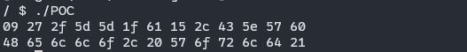
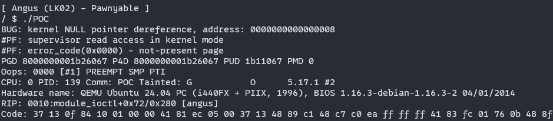

# 漏洞分析

*本次的利用环境中取消了smap保护并设值了/proc/sys/vm/mmap_min_addr这个系统变量为0*

总的来说是一种比较原始的利用方式，在当前的内核中已经引入了多种防护措施基本上完全预防了这这种攻击手法。所以这次只是简单看下它的利用思路

本次的带漏洞驱动的中的主要功能是对用户传入的数据进行异或加密，在驱动中体现为：

```c
long xor(XorCipher *ctx) {
  size_t i;

  if (!ctx->data || !ctx->key) return -EINVAL;
  for (i = 0; i < ctx->datalen; i++)
    ctx->data[i] ^= ctx->key[i % ctx->keylen];
  return 0;
}
```

它包含了一个自定义的结构体XorCipher，这结构体包含了对应的key数据及其长度以及data数据及其长度：

```c
typedef struct {
  char *key;
  char *data;
  size_t keylen;
  size_t datalen;
} XorCipher;
```

在驱动中存在一些决定后面ioctl操作的宏定义：

```c
#define CMD_INIT    0x13370001
#define CMD_SETKEY  0x13370002
#define CMD_SETDATA 0x13370003
#define CMD_GETDATA 0x13370004
#define CMD_ENCRYPT 0x13370005
#define CMD_DECRYPT 0x13370006
```

这些宏定义在后面module_ioctl 的switch操作中会被使用。首先看下驱动在被调用初始化时完成的功能为：

```c
    case CMD_INIT:
      if (!ctx)
        filp->private_data = (void*)kzalloc(sizeof(XorCipher), GFP_KERNEL);
      if (!filp->private_data) return -ENOMEM;
      break;
```

之后是设置key数据的操作，限制了key数据的长度，对原始key指针对应的内存位置进行了释放，最后将用户传入的key数据写入结构体的对应指针指向的内存位置：

```c
    case CMD_SETKEY:
      if (!ctx) return -EINVAL;
      if (!req.ptr || req.len > 0x1000) return -EINVAL;
      if (ctx->key) kfree(ctx->key);
      if (!(ctx->key = (char*)kmalloc(req.len, GFP_KERNEL))) return -ENOMEM;

      if (copy_from_user(ctx->key, req.ptr, req.len)) {
        kfree(ctx->key);
        ctx->key = NULL;
        return -EINVAL;
      }

      ctx->keylen = req.len;
      break;
```

与设置key数据相同的，也完成了对data数据的传入与设置：

```c
    case CMD_SETDATA:
      if (!ctx) return -EINVAL;
      if (!req.ptr || req.len > 0x1000) return -EINVAL;
      if (ctx->data) kfree(ctx->data);
      if (!(ctx->data = (char*)kmalloc(req.len, GFP_KERNEL))) return -ENOMEM;
      
      if (copy_from_user(ctx->data, req.ptr, req.len)) {
        kfree(ctx->key);
        ctx->key = NULL;
        return -EINVAL;
      }

      ctx->datalen = req.len;
      break;
```

由于异或操作有自反性，所以加密解密可以直接用同一个xor函数，最后用户可以通过CMD_GETDATA获取加密或者解密后的data数据：

```c
    case CMD_GETDATA:
      if (!ctx->data) return -EINVAL;
      if (!req.ptr || req.len > ctx->datalen) return -EINVAL;
      if (copy_to_user(req.ptr, ctx->data, req.len)) return -EINVAL;
      break;
```

本次的实验环境中不存在溢出漏洞或者UAF，但是存在一个空指针解引用的漏洞，它是这样形成的：

```c
ctx = (XorCipher*)filp->private_data;
```

在这里获取了filp中的private_data，并将其转换成XorCipher类型的结构进行后续的使用，在CMD_SETKEY以及CMD_SETDATA操作中均对这个ctx进行了初始化检查：

```c
if (!ctx) return -EINVAL;
```

但是在CMD_SETDATA操作中却没有对其中的key部分进行初始化检查：

```c
if (!ctx->data) return -EINVAL;
```

我们可以写个正常的驱动调用程序验证一下：

```c
#include <fcntl.h>
#include <stdio.h>
#include <stdlib.h>
#include <sys/ioctl.h>
#include <unistd.h>

#define CMD_INIT 0x13370001
#define CMD_SETKEY 0x13370002
#define CMD_SETDATA 0x13370003
#define CMD_GETDATA 0x13370004
#define CMD_ENCRYPT 0x13370005
#define CMD_DECRYPT 0x13370006

int fd = 0;

typedef struct {
  char *ptr;
  size_t len;
} request_t;

int angus_init(void) {
  request_t req = {NULL};
  return ioctl(fd, CMD_INIT, &req);
}
int angus_setkey(char *key, size_t keylen) {
  request_t req = {.ptr = key, .len = keylen};
  return ioctl(fd, CMD_SETKEY, &req);
}
int angus_setdata(char *data, size_t datalen) {
  request_t req = {.ptr = data, .len = datalen};
  return ioctl(fd, CMD_SETDATA, &req);
}
int angus_getdata(char *data, size_t datalen) {
  request_t req = {.ptr = data, .len = datalen};
  return ioctl(fd, CMD_GETDATA, &req);
}
int angus_encrypt() {
  request_t req = {NULL};
  return ioctl(fd, CMD_ENCRYPT, &req);
}
int angus_decrypt() {
  request_t req = {NULL};
  return ioctl(fd, CMD_ENCRYPT, &req);
}

int main() {
  unsigned char buf[0x10];
  fd = open("/dev/angus", O_RDWR);
  if (fd == -1)
    perror("/dev/angus");

  angus_init();
  angus_setkey("ABC123", 6);
  angus_setdata("Hello, World!", 13);

  angus_encrypt();
  angus_getdata(buf, 13);
  for (int i = 0; i < 13; i++) {
    printf("%02x ", buf[i]);
  }
  putchar('\n');

  angus_decrypt();
  angus_getdata(buf, 13);
  for (int i = 0; i < 13; i++) {
    printf("%02x ", buf[i]);
  }
  putchar('\n');

  close(fd);
  return 0;
}
```

在实验环境中的正常调用情况为：



然后我们尝试不初始化直接加密操作：



会发现内核崩溃了，崩溃的原因是尝试对0000000000000008 进行解引用，也就是所谓的空指针解引用